# Paper Shaders

Upload a 3D model and pick a surface material: liquid metal, wood, water, glass, ice, and more. The texture is built from the model's own 3D surface, so it works on any model, even without UV coordinates. You can add stickers and scratch wear on top, then export a PNG image or a looping video.

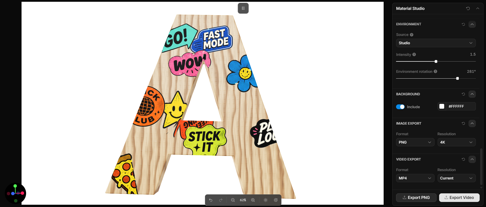

## Materials

| | | | | |
|:-:|:-:|:-:|:-:|:-:|
| 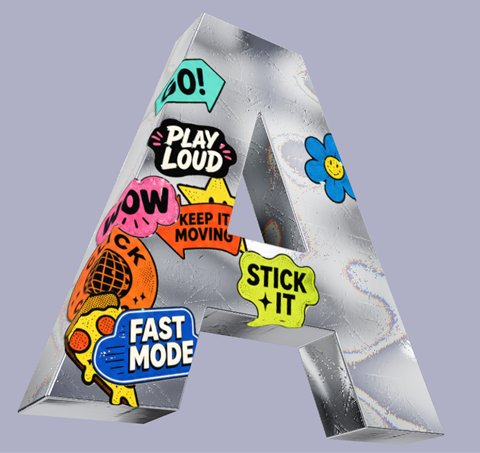 | 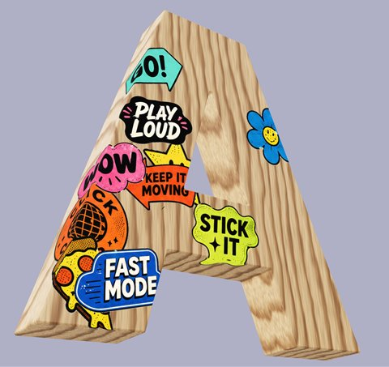 | 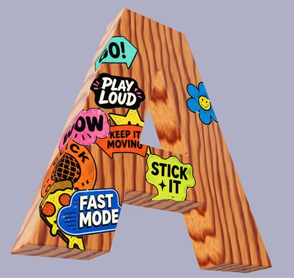 | 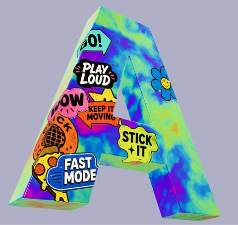 | 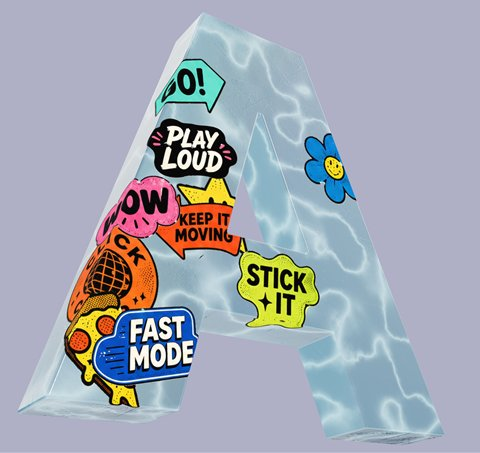 |
| **Liquid Metal** | **Wood** | **Warm Wood** | **Liquid** | **Water** |
| 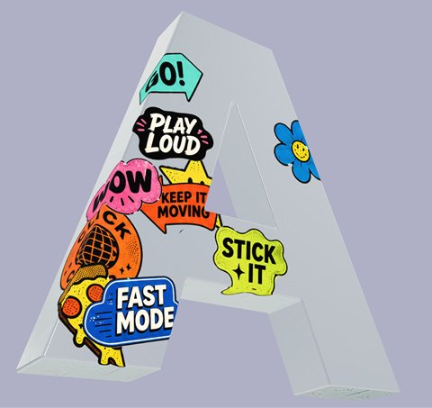 | 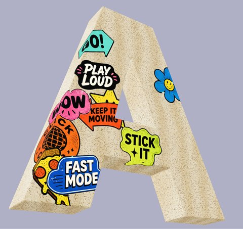 | 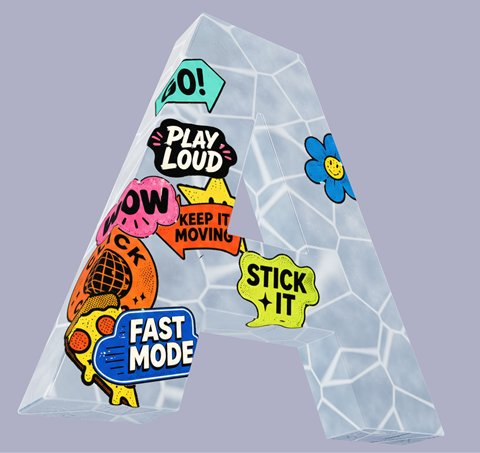 | 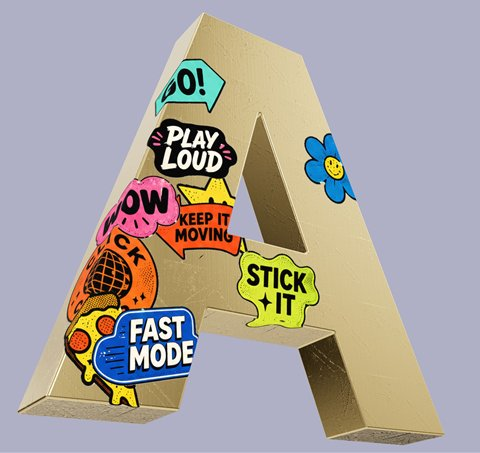 | 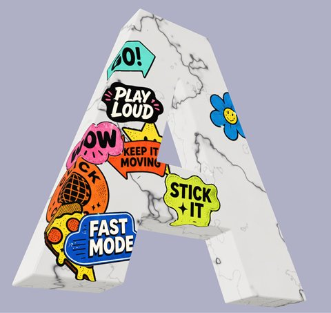 |
| **Glass** | **Sand** | **Ice** | **Gold** | **Marble** |

## Features

- **Upload any model:** GLB, self-contained GLTF, OBJ, or STL files.
- **10 surface materials:** Liquid Metal uses Paper Design's animated shader. The other nine are generated by code from the model's surface, so they need no UV coordinates. Texture scale and tint are adjustable.
- **Glass, water, and ice:** light passes through them. Their edges tint with thickness, and water has moving caustic light lines.
- **Seamless animation:** Liquid Metal, Liquid, and Water loop without a visible jump, following the timeline.
- **Stickers:** PNG artwork follows the model's surface and stays attached as it rotates.
- **Scratch wear:** a grayscale scratch mask adds surface wear to any material. It's applied from three directions, so there are no seams.
- **Lighting:** choose studio light presets or upload an HDR or EXR image. The lighting reflected on the model is separate from the canvas background color.
- **Export:** PNG or JPG images up to 8K, and MP4 or WebM loops.

## Getting started

Requires Node.js 22 or newer.

```bash
npm ci
npm run dev
```

The dev server picks a free port and prints the local URL.

| Command | What it does |
| --- | --- |
| `npm run dev` | Start the development server |
| `npm run build` | Type-check and build for production into `dist/` |
| `npm run preview` | Serve the production build |
| `npm run typecheck` | Run the TypeScript checks |
| `npx vitest run src/app` | Run the app's unit tests |

## Built with

- [Toolcraft](https://toolcraft.sh) by Pixel Point: the editor, controls, timeline, and export
- [Three.js](https://threejs.org): 3D rendering and lighting
- [Paper Design Shaders](https://github.com/paper-design/shaders): the original Liquid Metal shader
- React 19, TypeScript, Vite, Tailwind CSS

## Project structure

```
src/app/
  app-schema.ts                  Controls and panel layout
  liquid-metal-materials.ts      Code for the 9 generated materials, glass/water refraction
  liquid-metal-surface-shader.ts Liquid Metal surface and scratch relief
  liquid-metal-scene.ts          Three.js scene, material, and lighting
  liquid-metal-renderer.tsx      Canvas output and pointer interaction
  liquid-metal-export.ts         PNG and video export
```

## Credits

The Liquid Metal material adapts the open-source Liquid Metal shader from [Paper Design Shaders](https://github.com/paper-design/shaders). This is an independent project, not affiliated with Paper Design or Pixel Point.

## License

MIT. See [LICENSE.md](LICENSE.md). This project includes Toolcraft source code by Pixel Point, also under MIT. Third-party notices are in [NOTICE.md](NOTICE.md).
